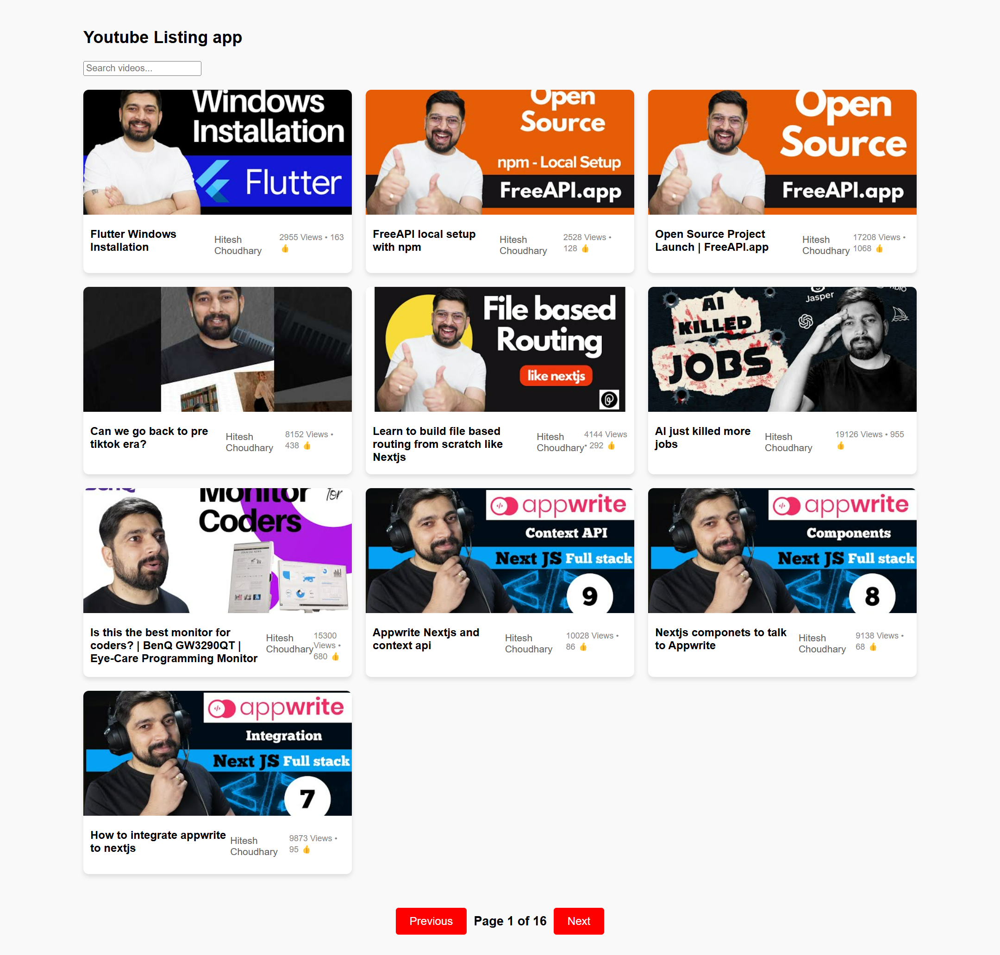

# YouTube Video Listing App
A simple web application that fetches and displays YouTube videos using an API, allowing users to browse and navigate through different pages of videos.

## Features
- Fetches and displays YouTube videos dynamically.
- Pagination support to navigate through different pages of videos.
- Displays video title, channel name, views, and likes.
- Clicking on a video redirects to YouTube.
- Responsive design for mobile and desktop users.

### Video Listing

## Deployment
You can access the live version of this application at:
👉

